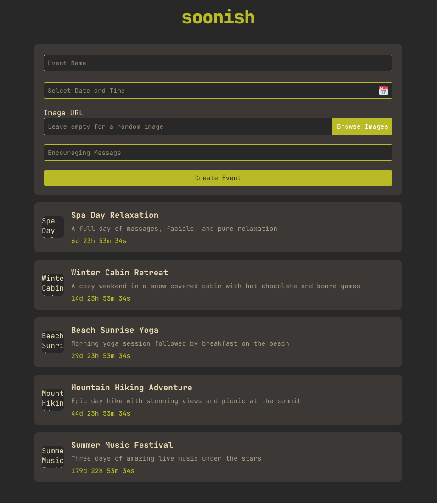
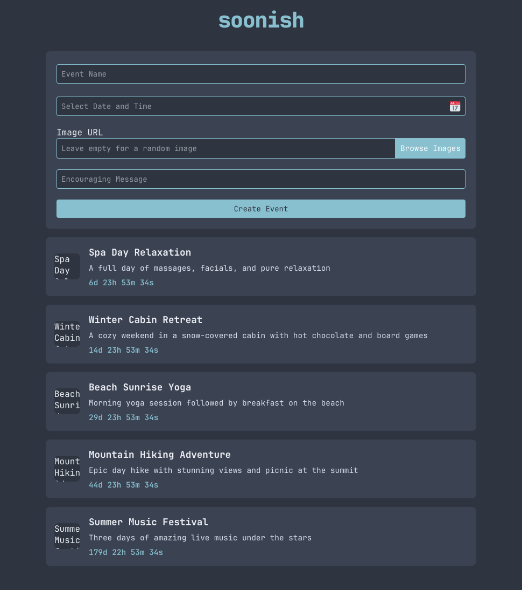
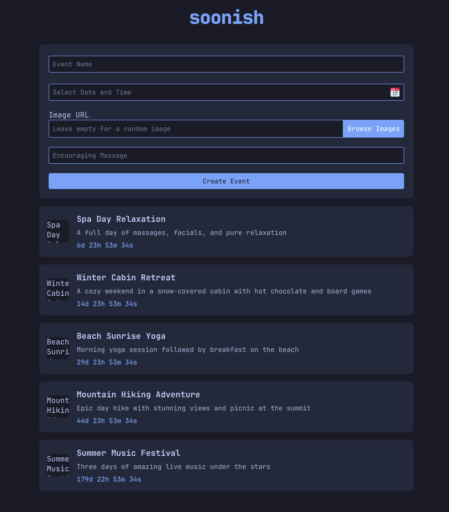
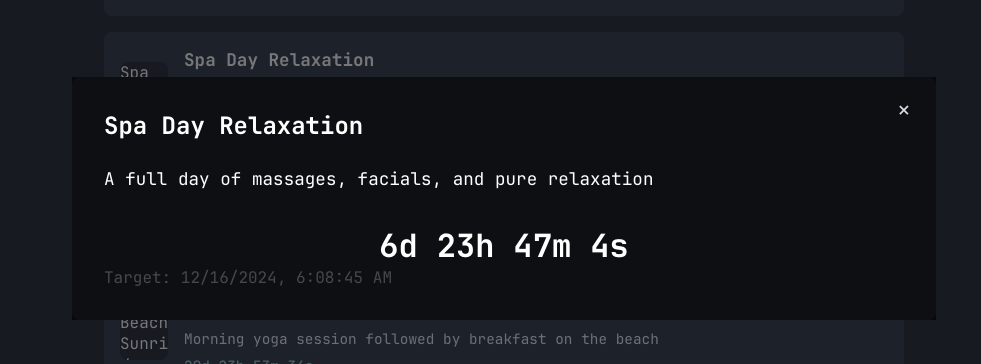

# Soonish - Event Countdown Application

Soonish is a sleek web application that helps you track upcoming events with beautiful visual countdowns. Built with FastAPI and modern web technologies, it provides an intuitive interface for managing your important dates and events.

## Screenshots

### Themes
Choose from three beautiful themes to match your style:

#### Gruvbox Theme


#### Nord Theme


#### Tokyo Night Theme


### Event Cards
Smart, compact event cards show you what matters:



### Event Backgrounds
Personalize your events with beautiful backgrounds:


## Features

### Event Management
- **Create Events**: Add new events with custom names, target dates, and messages
- **Visual Countdowns**: Each event displays a live countdown showing days, hours, minutes, and seconds
- **Smart Sorting**: Events are automatically sorted by time remaining, with closest events first
- **Context Menu**: Right-click any event to edit or delete it
- **Event Details**: Click any event to view full details

### Image Integration
- **Event Images**: Each event can have an associated image
- **Image Picker**: Built-in image selector with curated Unsplash images
- **Image Preview**: Preview selected images before creating an event
- **Compact Display**: Events show thumbnail-sized images (48x48px) for a clean interface

### User Interface
- **Modern Design**: Clean, modern interface with a dark theme
- **Theme Options**: Choose between Gruvbox, Nord, and Tokyo Night themes
- **Responsive Layout**: Works well on different screen sizes
- **Interactive Elements**: Hover effects and smooth transitions

### Technical Features
- **Real-time Updates**: Countdowns update in real-time
- **FastAPI Backend**: Fast and efficient Python-based backend
- **Static Image Pool**: Curated collection of Unsplash images for quick loading
- **Error Handling**: Graceful handling of image loading errors with fallbacks

## Getting Started

### Using Docker (Recommended)

1. Make sure you have Docker and Docker Compose installed on your system.

2. Clone the repository and navigate to the project directory:
```bash
git clone https://github.com/yourusername/soonish.git
cd soonish
```

3. Configure the environment (optional):
```bash
cp .env.example .env
```
Edit the `.env` file to change the host port (default is 8000)

4. Start the application using Docker Compose:
```bash
docker compose up
```

5. Open your browser and navigate to `http://localhost:8000` (or your configured port)

The application will automatically reload when you make changes to the code.

### Manual Installation

If you prefer not to use Docker, you can run the application directly:

1. Install the required dependencies:
```bash
pip install fastapi uvicorn jinja2 python-multipart
```

2. Run the application:
```bash
uvicorn app:app --reload
```

3. Open your browser and navigate to `http://localhost:8000`

## Usage

1. **Creating an Event**:
   - Click the "Add Event" button
   - Fill in the event name and target date
   - (Optional) Add a message and select an image
   - Click "Create Event"

2. **Managing Events**:
   - Events are automatically sorted by time remaining
   - Left-click an event to view details
   - Right-click an event to edit or delete it
   - Events with passed target dates will show "Time's up!"

3. **Customizing the Look**:
   - Use the theme switcher in the top-right to change the application theme
   - Choose from Gruvbox, Nord, or Tokyo Night themes

## Development

### Project Structure
```
soonish/
├── app/
│   └── templates/
│       └── index.html
├── static/
│   └── styles.css
├── app.py
├── Dockerfile
├── docker-compose.yml
├── .env.example
└── requirements.txt
```

### Environment Variables

- `SOONISH_PORT`: The port number on your host machine (default: 8000)

### Docker Commands

- Start the application: `docker compose up`
- Rebuild the container: `docker compose up --build`
- Stop the application: `docker compose down`
- View logs: `docker compose logs -f`
- Run on a different port: `SOONISH_PORT=3000 docker compose up`

## Contributing

Feel free to submit issues and enhancement requests!
